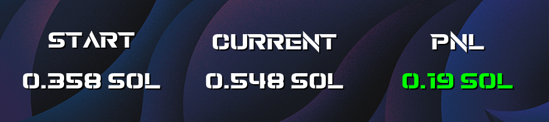

# PNL Tracker by Arboff

🔹 A simple and efficient **PNL (Profit & Loss) tracker** for Solana trades. This tool helps you monitor your trading performance by tracking wallet transactions, realized/unrealized gains, and overall profitability.




## 🚀 Features

- 📊 Tracks wallet transactions automatically
- 💰 Displays realized and unrealized gains
- 📈 Provides overall profitability statistics
- ⚡ Simple setup with a Solana wallet address

## 🛠️ Requirements

Developed with Python. Install the required libraries with:

```sh
pip install pyperclip pygame requests
```

## ⚙️ Setup

1. Open `config.json` and change the wallet address to your Solana address (**ONLY WORKS WITH SOLANA ADDRESSES**).
2. To change the background image, replace `bg.png` with any `.png` file of size **900x200** (otherwise, issues may occur).
3. The tracker saves the initial value on launch to `sol.arboff`. If you wish to reset the tracker, delete this file before starting.
4. Ensure the following mandatory files are present in the same folder:
   - `font.otf`
   - `config.json`
   - `bg.png`
   - `icon.ico`

## 💻 Usage

### 🖥️ Windows

Run `PNL.exe` after setting up `config.json`.

### 🐧 Linux

```sh
pip install -r requirements.txt
```

```sh
git clone https://github.com/Arboff/PNL_Tracker
cd PNL_Tracker/
python3 main.py
```

## ❤️ Support

If you want to support my work, you can donate SOL to:
**`G4t6feP6sDiwvzB6v9n9719H7u8X5EetUpeSWCmmMsQW`**

## 📜 License

This project is licensed under the **MIT License**. See the `LICENSE` file for details.
